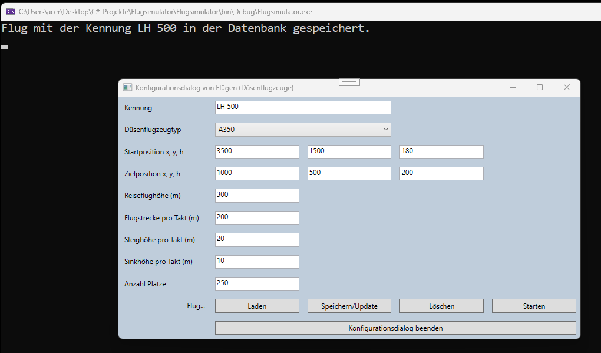
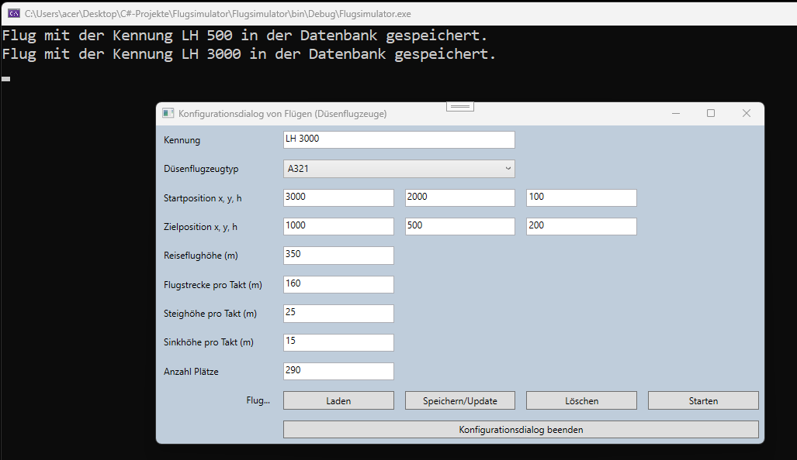
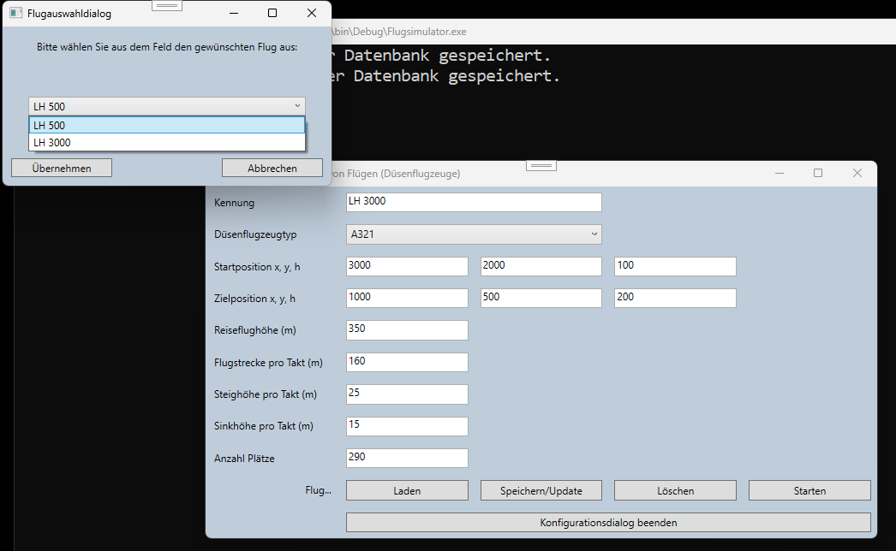
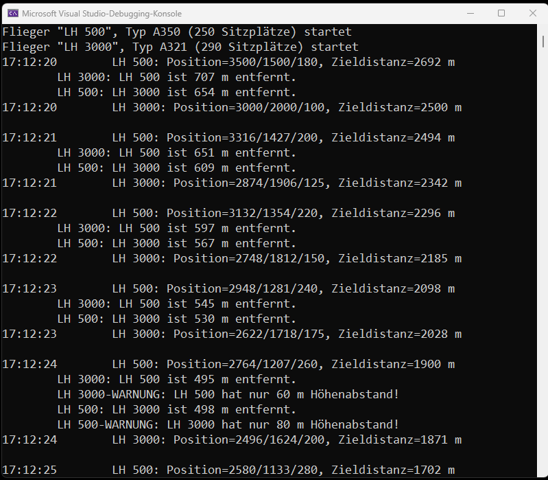
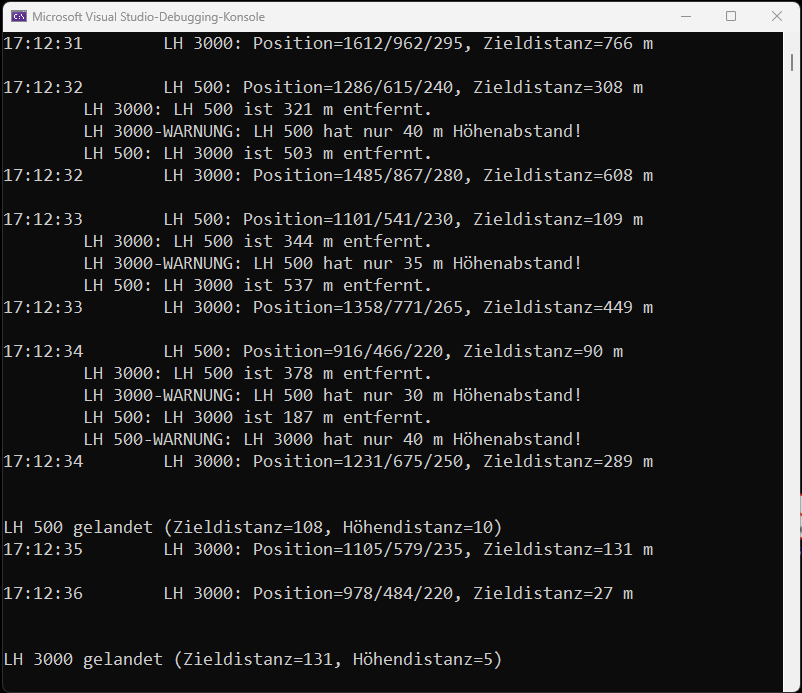

# Flugsimulator

Ein Lernprojekt in C# / WPF, das die Verwaltung und Simulation von Düsenflugzeugen demonstriert.  
Die Flugzeuge werden in einer Db4o‑Objektdatenbank gespeichert und können über die Benutzeroberfläche geladen, gestartet, geflogen und gelandet werden.

---

## Funktionen
- Flugzeuge mit Kennung in die Datenbank laden
- Bereits gespeicherte Flüge aus der Datenbank abrufen
- Flüge vollständig simulieren: vom Laden über den Start, die Flugphase bis zur Landung
- Dokumentation und Screenshots zur Veranschaulichung

---

## Screenshots

### 1. Flugzeug laden

### 2. Weiteres Flugzeug laden

### 3. Flüge aus der Datenbank abrufen

### 4. Start beider Flüge

### 5. Landung

---

## Technologien
- C# / .NET Framework
- WPF / XAML für die Benutzeroberfläche
- Db4o als Objektdatenbank
- GitHub für Versionskontrolle und Dokumentation

---

## Projektstruktur

Flugsimulator/
 ├─ README.md
 ├─ .gitignore
 ├─ .gitattributes
 ├─ Flugsimulator.slnx
 ├─ docs/
 │   └─ images/
 │       ├─ flug_laden1.png
 │       ├─ flug_laden2.png
 │       ├─ fluege_abrufen.png
 │       ├─ start_fluege.png
 │       └─ landung.png
 └─ Quellcode-Dateien (.cs, .xaml)
 
---

## Hinweis
Die Screenshots liegen im Ordner `docs/images/`.  
Im README werden sie automatisch eingebunden und auf GitHub angezeigt.

---

## Hintergrund
Dieses Projekt entstand im Rahmen meiner Weiterbildung zum Fachinformatiker für Anwendungsentwicklung (ILS Hamburg, Abschluss 2025).

